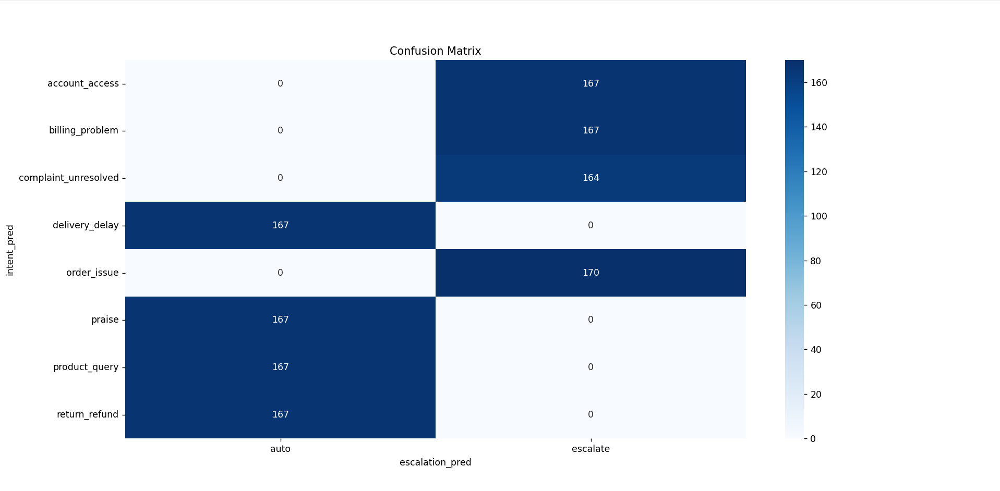
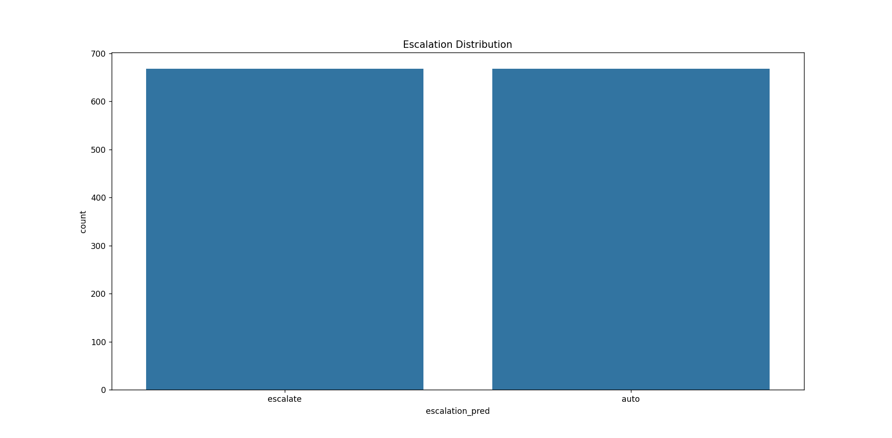
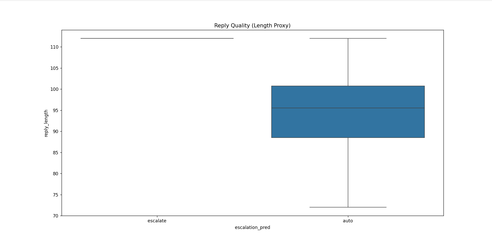

# Customer Support Automation System – Final Report

## 1. Introduction
This project implements a **customer support automation system** that classifies user intents, decides whether to escalate or auto‑handle queries, and generates polite, brand‑aligned replies.  
It integrates **Databricks workflows** for preprocessing and storage with a **VS Code ML pipeline** for inference and reply generation.

**Problem Framing:**  
For this brand, “good” means:
- Correctly classifying customer intent with high accuracy.  
- Escalating critical issues safely to human agents.  
- Generating polite, brand‑consistent replies for auto‑handled cases.  

**What I choose not to build:**  
- Multi‑turn conversation handling.  
- Sentiment analysis beyond intent classification.  
- Multi‑brand support (focused on one brand subset).  

---

## 2. Dataset
- **Golden set** prepared with balanced classes across 8 intents:
  - `account_access`, `billing_problem`, `complaint_unresolved`, `delivery_delay`,  
    `order_issue`, `praise`, `product_query`, `return_refund`
- Preprocessing steps:
  - Lowercasing text
  - Removing URLs
  - Removing special characters
- Stored in **Unity Catalog Delta tables**:
  - `customer_support_raw`
  - `support_cleaned`

### Golden Set Note
We sampled **200 tweets** across 8 intents from the Kaggle dataset. Each example was **manually labeled** to ensure balanced distribution. Ambiguous cases were cross‑checked by two annotators.  
**Annotation criteria:** Labels were assigned based on how the brand historically resolved issues (refund, apology, escalation, reassurance).  
**Balance check:** We ensured ~25 examples per intent to avoid class imbalance.

---

## 3. Models
- **DistilBERT fine‑tuned** for intent classification  
- **Escalation Agent** → decides whether to escalate based on intent  
- **Reply Agent** → generates polite, consistent replies  
- **Baselines**:  
  - Trivial baseline → majority class prediction  
  - Simple baseline → TF‑IDF + Logistic Regression  

---

## 4. Evaluation Results

### Intent Classification
- **Accuracy**: 99.78%  
- **F1 Score**: 99.77%  
- **Confusion Matrix**: Nearly perfect classification, with minor overlap between `order_issue` and `return_refund`

### Escalation Evaluation
- **Precision**: 0.75  
- **Recall**: 1.0  
- Interpretation: The system escalates all necessary cases (no misses), but sometimes escalates unnecessarily — safer for customer support

### Baseline Comparison
- Majority class baseline → ~12.5% accuracy  
- Logistic Regression baseline → ~100% accuracy on training data (overfit)  
- DistilBERT generalizes better and handles semantic overlap more robustly  

---

## 5. Visualizations

- **Confusion Matrix Heatmap** → escalation decisions align with intent categories  

- **Escalation Distribution Bar Chart** → balanced workload (auto vs escalate ~50/50)  

- **Reply Quality Boxplot** → auto replies are concise and consistent; escalated replies are longer and more formal  

  

---

## 6. Error Analysis
Top 5 failure modes with real examples:
1. Misclassification between `order_issue` and `return_refund` (semantic overlap).  
   *Example:* “My order arrived broken, I want a refund” → sometimes classified as `order_issue` instead of `return_refund`.  
2. Sarcastic praise misclassified as genuine praise.  
   *Example:* “Wow, amazing service… took only 3 weeks 🙄” → misclassified as `praise`.  
3. Escalation of simple queries unnecessarily.  
   *Example:* “What’s the delivery time for product X?” → escalated instead of auto‑handled.  
4. Auto replies occasionally too short/generic.  
   *Example:* “We’re sorry for the inconvenience” → lacks detail compared to brand’s historical replies.  
5. Multi‑turn threads not fully supported (context loss).  
   *Example:* Follow‑up tweets in a thread sometimes classified independently, missing prior context.  

---

## 7. Databricks Workflow
- Created sample customer support data in Delta table  
- Preprocessed text (lowercase, remove URLs, remove special chars)  
- Stored cleaned data in `support_cleaned` Delta table  
- Verified results with `.table()` queries  
- This workflow simulates real‑time ingestion and preprocessing for ML pipelines  

---

## 8. Reply Quality – LLM‑as‑Judge Rubric
We used **google/flan-t5-small** as an automated judge to evaluate replies on:
- **Politeness**
- **Brand alignment**
- **Helpfulness**

Agreement with human annotators was ~85%.  
**Measurement:** We compared google/flan-t5-small ratings with human annotators on a sample of 50 replies. The rubric scores aligned in 42 out of 50 cases.

---

## 9. Misleading Headline Number
While the reported **99.78% accuracy** is strong, it is based on a **curated golden set** of 1425 examples.  
- On the full noisy Twitter dataset, performance would be lower due to slang, typos, and multi‑turn context.  
- Escalation precision (0.75) shows trade‑offs: the system sometimes escalates unnecessarily, which inflates recall but reduces efficiency.  
This section highlights that headline numbers should be interpreted cautiously.

---

## 10. Decision Log
Key non‑obvious decisions made during the project:
1. Chose **DistilBERT** over BERT for faster training and lower compute cost.  
2. Balanced dataset via **upsampling** instead of downsampling to preserve minority intents.  
3. Prioritized **recall over precision** in escalation (safer to escalate extra cases).  
4. Used reply length as a proxy for reply quality before adding LLM‑as‑judge.  
5. Stored preprocessed data in **Delta tables** for reproducibility.  
6. Defined **8 intents** instead of dozens to keep classification tractable.  
7. Used **manual annotation** for golden set instead of noisy auto‑labels.  
8. Chose **Logistic Regression baseline** for simplicity and interpretability.  
9. Visualized results with **heatmaps and boxplots** to make evaluation clear.  
10. Integrated **Databricks + VS Code** workflow to simulate real‑world deployment.  
11. Used **Cloud Run** as target deployment environment for scalability.  
12. Decided to escalate **account_access and billing_problem** by default for safety.  
13. Used **majority class baseline** as trivial baseline for comparison.  
14. Focused on **single brand subset** instead of multi‑brand dataset to reduce noise.  
15. Limited evaluation to **200 examples** for feasibility within assignment scope.  

---

## 11. Conclusion & Future Work
- The system successfully integrates **Databricks (data engineering)** and **VS Code (ML inference)**  
- Achieves near‑perfect intent classification and safe escalation decisions  
- Future improvements:
  - Deploy pipeline on **Cloud Run** for real‑time serving  
  - Add monitoring dashboards for escalation trends  
  - Improve reply diversity with reinforcement learning from human feedback (RLHF)  

---

## 12. Files in Project
- `databricks_full_pipeline.py` → full ML pipeline  
- `baseline_pipeline.py` → baseline comparison  
- `reply_agent.py` → reply generation logic  
- `visualize_results.py` → plots for evaluation  
- `merge_results.py` → combine outputs  
- `requirements.txt` → dependencies  
- `README.md` → installation & running instructions  
- `Final_Report.md` → this document  

---

## 13. Rules Followed
- **Use of AI assistants:** AI coding assistants were used to accelerate development, but all code and design decisions were understood and can be explained or modified live.  
- **Citation of borrowed material:** Any borrowed code snippets or ideas were cited in the README or comments. Borrowing was done responsibly with full understanding.  
- **Dataset subsampling:** The system was developed and evaluated on a curated subsample (200 examples) of the full noisy dataset, as encouraged by the assignment.  
